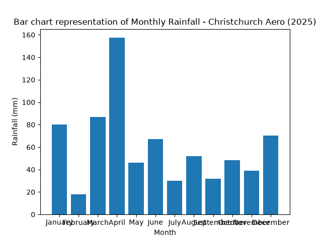
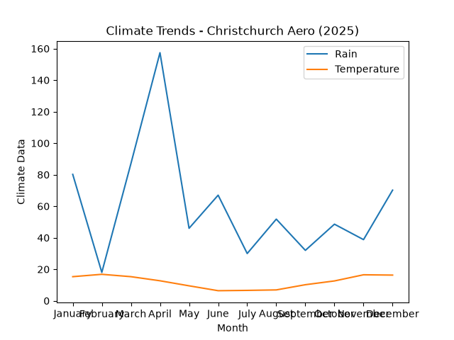
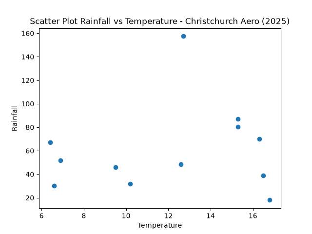

# Christchurch Climate Data Analysis

An interactive Python data analysis project exploring monthly rainfall and temperature patterns across multiple weather stations in Christchurch, New Zealand.

## Overview

This project analyses historical climate data from four Christchurch weather stations using Python.

The application allows users to select a weather station and an available year through a command-line interface. It then cleans and processes the corresponding rainfall and temperature datasets, displays the monthly observations, calculates summary statistics, and generates several visualisations.

The project was originally developed as part of COSC480 - Computer Programming and was later refined for inclusion in my data science portfolio.

## Features

* Interactive weather station selection
* Dynamic year selection based on available data
* Input validation
* Automated cleaning of incomplete climate records
* Rainfall and temperature dataset integration
* Multi-station climate analysis
* Monthly rainfall and temperature tables
* Summary statistics using NumPy
* Rainfall and temperature correlation analysis
* Data visualisation using Matplotlib

## Weather Stations

The analysis currently includes four Christchurch locations:

* Christchurch Aero
* Bromley Ews
* Christchurch Gardens
* Kyle St Ews

Users can analyse an individual station or select **All Stations** to calculate average monthly rainfall and temperature across the four locations.

## Dataset

The project uses historical rainfall and temperature data from the National Institute of Water and Atmospheric Research (NIWA) DataHub.

Each dataset contains:

* year
* monthly observations from January to December
* annual values

For this analysis, annual totals are removed because the project focuses on monthly climate patterns.

Years containing missing monthly observations are also removed during preprocessing to ensure that statistical calculations and comparisons are based only on complete records.

Rainfall and temperature records are then matched so that only years available for both climate variables are retained.

**Data availability:** The original climate station datasets are not included in this repository due to the redistribution conditions of the Earth Sciences New Zealand (formerly NIWA) DataHub licence. The data used for this project were obtained from the DataHub for educational purposes. Example visualisations derived from the analysis are included in the repository.

### Data source

National Institute of Water and Atmospheric Research (NIWA) DataHub
https://data.niwa.co.nz/

## Technologies

* **Python**
* **pandas** — data loading, cleaning, filtering and tabular manipulation
* **NumPy** — numerical and statistical analysis
* **Matplotlib** — climate data visualisation

## Project Structure

```text
christchurch-climate-data-analysis/
│
├── data/ # Local climate datasets (not included)
│
├── images/
│   ├── climate_trends.png
│   ├── monthly_rainfall.png
│   └── rainfall_temperature_scatter.png
│
├── src/
│   └── main.py
│
├── .gitignore
├── README.md
└── requirements.txt
```

## Analysis Workflow

The program follows the workflow:

```text
Load climate datasets
        ↓
Remove annual columns
        ↓
Remove incomplete years
        ↓
Match rainfall and temperature years
        ↓
Select weather station
        ↓
Select available year
        ↓
Create monthly climate table
        ↓
Calculate statistics
        ↓
Generate visualisations
```

## Statistical Analysis

For the selected location and year, the program calculates:

* average monthly rainfall
* average monthly temperature
* rainfall standard deviation
* temperature standard deviation
* Pearson correlation between rainfall and temperature

The correlation provides a simple measure of the relationship between monthly temperature and rainfall for the selected year.

## Visualisations

The project generates several visualisations to explore climate patterns for the selected weather station and year.

### Monthly Rainfall

A bar chart shows how rainfall is distributed across the twelve months of the selected year.



### Climate Trends

A line plot compares monthly rainfall and temperature patterns throughout the year, making seasonal changes easier to identify.



### Rainfall vs Temperature

A scatter plot explores the relationship between monthly temperature and rainfall for the selected year.



## Running the Project

### 1. Clone the repository

```bash
git clone <repository-url>
cd christchurch-climate-data-analysis
```

### 2. Create a virtual environment

```bash
python -m venv .venv
```

Activate it on Windows:

```bash
.venv\Scripts\activate
```

On macOS/Linux:

```bash
source .venv/bin/activate
```

### 3. Install the dependencies

```bash
pip install -r requirements.txt
```

### 4. Run the application

```bash
python src/main.py
```

The application will ask you to select a weather station and then display the years available for that location.

Example:

```text
Select a location:

[0] Christchurch Aero
[1] Bromley Ews
[2] Christchurch Gardens
[3] Kyle St Ews
[4] All Stations
```

## Skills Demonstrated

This project demonstrates practical experience with:

* Python programming
* data cleaning
* exploratory data analysis
* pandas DataFrames
* numerical analysis with NumPy
* data visualisation
* handling missing data
* combining multiple datasets
* user input validation
* reusable functions
* command-line application design
* Git and GitHub project organisation

## Future Improvements

Potential extensions to the project include:

* analysing climate trends across multiple years rather than one year at a time
* calculating long-term seasonal averages
* comparing weather stations directly
* adding additional climate variables
* exporting processed results
* creating more advanced visualisations
* developing an interactive dashboard

## Author

**Lavinia Roscia**

Postgraduate Diploma in Applied Data Science
University of Canterbury

Background in Biomedical Engineering.
